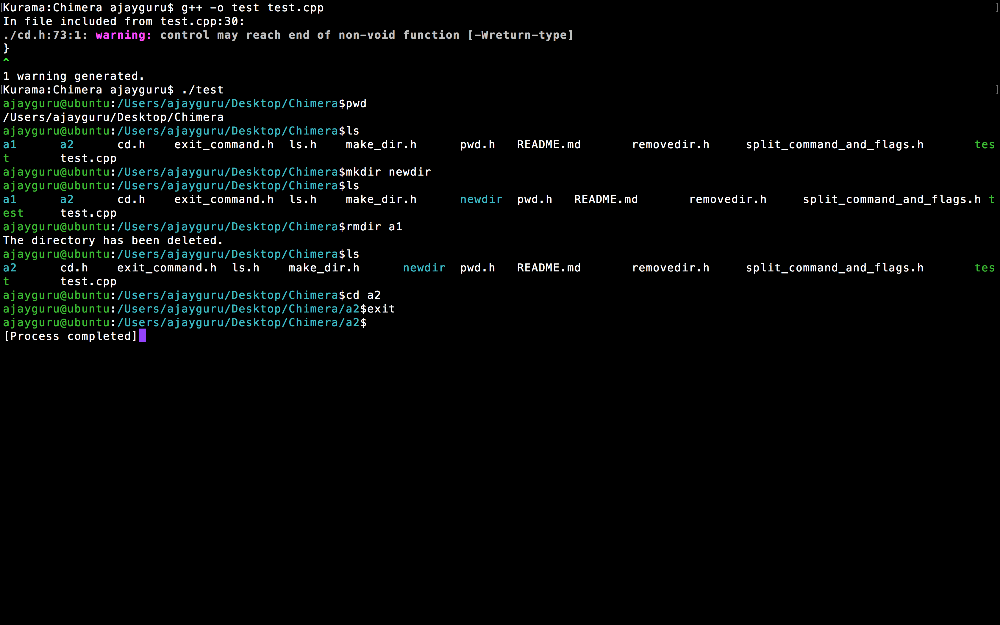

## Chimera

>Made with c++ and :heart:

```c
Following is the OS mini project 
a command line interpreter we like to call
Chimera
```


Chimera has following functions:

 * mkdir
 * cd
 * ls
 * rmdir
 * pwd 
 * exit

### Below are the code implementations of the Repo:
navigate to the cloned repo
* Running the test file:
```bash
   g++ -o test test.cpp
```

* Making a new directory:
```bash
  mkdir filename
```
* Removing a directory: 
```bash
rmdir filename 
```
* Listing out files:
```bash
ls
```
* Changing current directory:
```bash
cd filename
```
* Printing the current directory:
```bash 
pwd
```
* Exiting the terminal
```bash
exit
```





### Credits:

> [Monal Shadi](https://github.com/Monal5031)
> [Ajay Guru](https://github.com/guru-DeV-002)
> [Ishita Das](https://github.com/ishita27)
> [Kumar Himanshu](https://github.com/kumarhimanshu5128409)
> [Avkaran SIngh](https://github.com/avsingh999)
> [Madhuri Mahawar](https://github.com/madhuri-mahawar)
> [Monika Phadnis](https://github.com/guru-DeV-002)
> [Smit Rajput](https://github.com/desc1ple)
> [Jeet Meena](https://github.com/jeetmeena)
> [Natharam Jaipal](https://github.com/Natharam)
> [Puneet Bindal](https://github.com/rockstar777)
